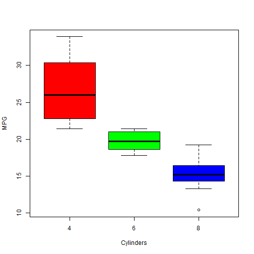

Developing Data Products : Course Project
========================================================
author: Rajesh D
date: Thu Dec 15 19:52:57 2016
autosize: true
transition: rotate

Exploring MTCars Data
========================================================
type: sub-section

The goal of this project is to present the Shiny application created as part of the course project for the Developing Data Products class. This project is geared towards making sure that the concepts of Shiny and presentations in R are well understood in this class 

- To build data product application using **shiny**
- To create data product related presentations using **R-Presentation or slidify** and it is published on rpubs.

The Application
========================================================
type: sub-section
This application consists of 4 tabs:
- Boxplot exploring the relationship between mpg and transmission / cylinders / Horse Power / gears / weight variables.
- Summary statistics of the variables.
- Data for the mtcars.
- Structure of data showing the input field to choose the variables.

The Data, application and the source code
========================================================
type: sub-section
This application uses the R's built-in dataset "mtcars" that is used to explore the data.

To show the understanding of using **shiny**, an application called **Exploring MTCARS Data** has been developed and deployed at: https://rajd216.shinyapps.io/mtcarstest/

Source code for this application is created using Single file (app.R) option and is available on the [GitHub](https://github.com/rajd216/DDPCourseProject).

Box Plot
=====================
Here is a boxplot shown exploring relation between mpg & cylinders, as an example. 

```r
boxplot(mpg ~ cyl, data = mtcars, col = c("red", "green", "blue"), xlab = "Cylinders", ylab = "MPG")
```


